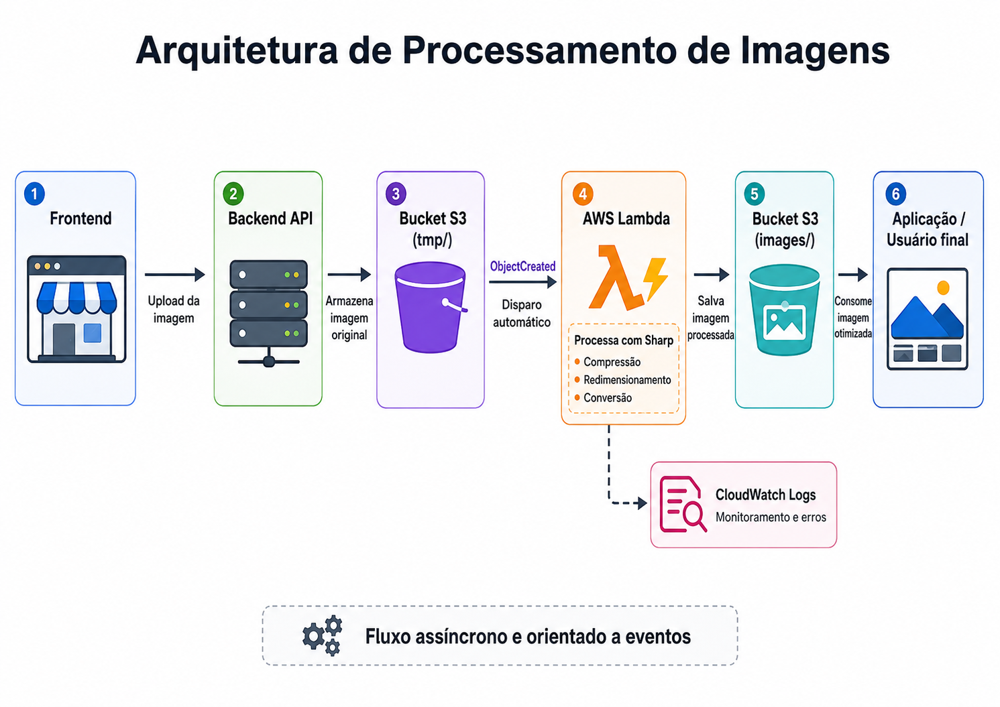

# Processamento de Imagens com AWS Lambda

Função serverless desenvolvida com TypeScript para processar imagens enviadas ao Amazon S3.

A aplicação utiliza uma arquitetura orientada a eventos: quando uma imagem é enviada para o diretório temporário do bucket, o Amazon S3 dispara automaticamente a AWS Lambda, que comprime, redimensiona e converte a imagem antes de armazená-la no diretório definitivo.

## Arquitetura



O fluxo funciona da seguinte forma:

1. O usuário envia uma imagem pelo frontend.
2. O backend recebe a imagem e realiza o upload para o diretório temporário do Amazon S3.
3. O evento `ObjectCreated` do S3 dispara automaticamente a AWS Lambda.
4. A função obtém a imagem original armazenada no diretório temporário.
5. O Sharp realiza a compressão, o redimensionamento e a conversão da imagem.
6. A imagem processada é armazenada no diretório definitivo do bucket.
7. Após o salvamento da imagem processada, o arquivo original é removido do diretório `tmp/`, evitando reprocessamentos, acúmulo de arquivos temporários e possíveis erros no fluxo.
8. A aplicação passa a utilizar a versão otimizada da imagem.
9. Logs de execução e erros são enviados ao Amazon CloudWatch.


## Objetivos

Este projeto foi criado para retirar o processamento de imagens do fluxo principal da API.

Com essa abordagem, o backend não precisa aguardar a compressão da imagem durante a requisição do usuário, reduzindo o acoplamento e permitindo que o processamento seja executado de forma assíncrona.

## Tecnologias

* Node.js
* TypeScript
* AWS Lambda
* Amazon S3
* Amazon CloudWatch
* AWS SDK
* Sharp
* Yarn

## Funcionalidades

* Processamento automático de imagens enviadas ao S3
* Compressão de imagens
* Redimensionamento
* Conversão para um formato otimizado
* Leitura de arquivos temporários
* Armazenamento da imagem processada
* Remoção da imagem temporária
* Registro de logs no CloudWatch
* Tratamento de erros durante o processamento

## Fluxo de armazenamento

As imagens originais são enviadas para um diretório temporário:

```text
tmp/
```

Após o processamento, a imagem otimizada é armazenada no diretório definitivo:

```text
images/
```

Exemplo:

```text
Bucket S3
├── tmp/
│   └── original-image.png
└── images/
    └── processed-image.webp
```

O evento da Lambda deve ser configurado para executar somente quando novos objetos forem adicionados ao prefixo temporário.

```text
Evento: ObjectCreated
Prefixo: tmp/
```

Essa configuração evita que a imagem processada dispare novamente a mesma função e gere um loop de execução.

## Estrutura do projeto

```text
.
├── docs/
│   └── fluxo.png
├── src/
│   └── main.ts
├── dist/
├── package.json
├── tsconfig.json
├── yarn.lock
└── README.md
```

A pasta `dist` é gerada durante o processo de build e não precisa ser adicionada ao repositório.


## Build

Para compilar o projeto TypeScript:

```bash
yarn build
```

O código compilado será gerado na pasta:

```text
dist/
```

## Pacote de deploy

Gere o build da aplicação:

```bash
yarn build
```

Depois, crie o pacote de implantação:

```bash
zip -r function.zip dist node_modules package.json
```

O arquivo `function.zip` deve ser enviado para a AWS Lambda.

Esse arquivo é apenas um artefato de deploy e não deve ser versionado no GitHub.

Adicione ao `.gitignore`:

```gitignore
node_modules/
dist/
function.zip
.env
```

## Configuração da AWS Lambda

Na configuração da função, defina o handler correspondente ao arquivo compilado.

Exemplo:

```text
dist/main.handler
```

O valor exato depende do nome do arquivo e da função exportada pelo projeto.

Configure também:

* Runtime Node.js compatível com o projeto
* Memória suficiente para o processamento com Sharp
* Tempo limite adequado para imagens maiores
* Variáveis de ambiente
* IAM Role com acesso ao S3
* Trigger do Amazon S3

## Permissões necessárias

A IAM Role da função precisa ter permissões para:

* Ler objetos do bucket
* Criar objetos no bucket
* Remover objetos temporários
* Escrever logs no CloudWatch

Exemplo das ações utilizadas:

```text
s3:GetObject
s3:PutObject
s3:DeleteObject
logs:CreateLogGroup
logs:CreateLogStream
logs:PutLogEvents
```

As permissões devem ser limitadas somente ao bucket e aos recursos utilizados pelo projeto.

## Trigger do Amazon S3

Configure um evento no bucket com as seguintes opções:

```text
Tipo de evento: ObjectCreated
Prefixo: tmp/
```

Quando uma imagem for adicionada nesse diretório, o S3 enviará o evento para a Lambda.

A função utilizará os dados do evento para identificar:

* Nome do bucket
* Chave do objeto
* Diretório da imagem
* Arquivo que será processado

## Observabilidade

As execuções da função podem ser acompanhadas pelo Amazon CloudWatch Logs.

Os logs ajudam a identificar:

* Início do processamento
* Chave da imagem recebida
* Conclusão do download
* Resultado da compressão
* Salvamento da imagem processada
* Remoção da imagem temporária
* Erros de leitura ou escrita no S3
* Falhas durante o processamento com Sharp

## Benefícios da arquitetura

* Processamento assíncrono
* Menor tempo de resposta do backend
* Redução do acoplamento entre a API e o processamento
* Escalabilidade automática
* Redução do tamanho das imagens
* Melhor desempenho no carregamento do frontend
* Execução orientada a eventos
* Monitoramento centralizado com CloudWatch

## Integração com o projeto principal

Esta função faz parte da arquitetura da SuperStore.

O backend é responsável por receber a imagem e armazená-la no diretório temporário do Amazon S3. A partir desse momento, a AWS Lambda assume o processamento sem bloquear a requisição original.

Após a conclusão, a imagem otimizada fica disponível para ser utilizada pelo frontend da aplicação.

## Status do projeto

A função está implementada e integrada ao Amazon S3 por meio de um trigger de criação de objetos.

Possíveis melhorias futuras:

* Criação de diferentes tamanhos da mesma imagem
* Geração de thumbnails
* Validação de formato antes do processamento
* Configuração de Dead Letter Queue
* Alertas de falhas no CloudWatch
* Testes automatizados para os eventos do S3
* Deploy automatizado com CI/CD


## Licença

Este projeto foi desenvolvido para fins de estudo e portfólio.
